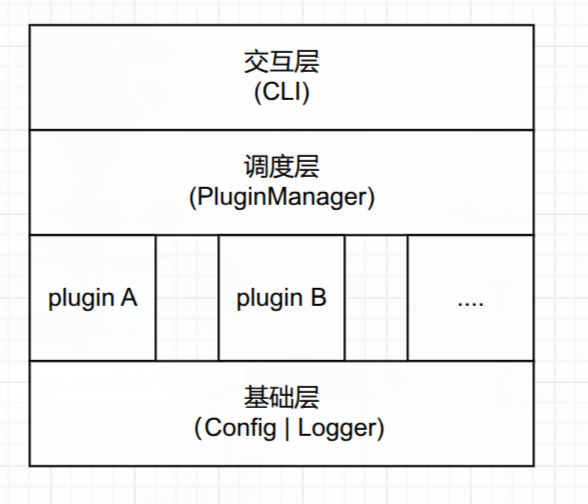

# 插件化执行系统

基于 Golang 实现的插件化执行系统，主程序不感知具体业务逻辑，通过动态加载插件完成数据处理。

## 目录结构

```
PluginsManager/
├── main.go              # 入口：初始化日志、配置、插件管理器，启动 CLI
├── cmd/
│   └── shell.go         # CLI 交互功能（命令解析、插件管理、数据发送）
├── config/
│   └── config.go        # YAML 配置加载，应用插件启用/禁用状态及专属配置
├── model/
│   ├── info.go          # Plugin 接口、PluginInfo、PluginResult、Configurable 等核心类型定义
│   └── manager.go       # 轻量级注册表（registry），仅供 init() 阶段使用
├── handler/
│   ├── manager.go       # PluginManager 结构体定义、导入注册表
│   ├── lifecycle.go     # Start/Stop：启动/停止所有插件 goroutine
│   ├── registration.go  # 插件注册、启用、禁用、注销
│   ├── query.go         # 插件信息查询（全部/已启用/已禁用/异常/详情）
│   ├── messaging.go     # 数据发送（Send / SendTo）与结果通道
│   └── worker.go        # worker goroutine + safeRun 异常隔离
├── logger/
│   ├── logger.go        # 异步日志系统，支持文件+控制台双输出、按天轮转
│   └── files.go         # 日志文件工具（创建目录、权限检查）
├── plugins/
│   ├── calculator.go    # 示例插件：四则运算计算器
│   ├── ai.go            # 示例插件：LLM 对话（DeepSeek API）
│   └── config.yaml      # 插件配置文件
├── logs/                # 日志输出目录（运行时生成）
└── go.mod
```

## 架构设计

### 核心分层



### 插件接口

```go
type Plugin interface {
    Name()    string
    Version() string
    Run(data map[string]interface{}) (map[string]interface{}, error)
}

// 可选：需要 YAML 配置的插件实现此接口
type Configurable interface {
    Plugin
    Configure(config map[string]interface{}) error
}
```

## 设计思路

### 1. 插件注册 init() + 全局注册表

每个插件通过 Go 的 `init()` 函数在程序启动时自动注册到 `model` 包的内部注册表：

```go
func init() {
    p := &MyPlugin{}
    if err := model.RegisterPlugin(p.Name(), p.Version(), p); err != nil {
        panic("register myplugin: " + err.Error())
    }
}
```

主程序仅需 `import _ "PluginsManager/plugins"` 即可加载所有插件，无需逐一引用具体类型。添加新插件只需在 `plugins/` 目录下新建文件并实现 `Plugin` 接口，主程序零修改。

`PluginManager` 在启动时通过 `ImportFrom(model.GetRegistered())` 导入注册表中的所有插件。

### 2. 并发模型 Channel + Goroutine

采用 Go 原生并发原语，每个已启用插件拥有独立的数据通道和 goroutine worker：

- **生产者**：CLI 通过 `/send` 或 `/sendall` 将 JSON 数据写入插件的 `chan []byte`
- **消费者**：每个插件的 `worker()` goroutine 从通道读取数据，反序列化后调用 `plugin.Run()`
- **结果收集**：worker 将 `PluginResult` 写入统一的 `resultCh`，外部 goroutine 消费并记录日志

### 3. 异常隔离 panic recover

`safeRun()` 方法包裹每次插件调用，捕获 panic 防止单个插件崩溃导致整个 worker 或主程序退出。发生异常的插件状态标记为 `error`，可通过 `/errored` 命令查看。异常状态在下次成功执行后自动清除。

### 4. 插件管理 — 状态与生命周期

| 操作 | 命令 | 说明 |
|------|------|------|
| 查看全部 | `/plugins` | 列出所有已注册插件 |
| 查看已启用 | `/enabled` | 仅显示启用中的插件 |
| 查看已禁用 | `/disabled` | 仅显示已禁用的插件 |
| 查看异常 | `/errored` | 显示运行中出错的插件 |
| 查看详情 | `/info <name>` | 显示名称、版本、状态 |
| 启用 | `/enable <name>` | 启用已禁用的插件 |
| 禁用 | `/disable <name>` | 禁用插件，不再接收数据 |
| 注销 | `/unregister <name>` | 完全移除插件 |
| 发送数据 | `/send <name> <json> ...` | 向一个或多个指定插件发送 JSON 数据 |
| 广播数据 | `/sendall <json>` | 向所有已启用插件广播 |

### 5. 日志系统

异步日志系统，核心特性：
- **双输出**：同时写入 stdout 和日志文件
- **按天轮转**：日志文件名包含日期，跨天自动切换新文件
- **调用栈信息**：每条日志附带源文件名和行号
- **五级日志**：DEBUG、INFO、WARN、ERROR、FATAL
- **对象池复用**：使用 `sync.Pool` 减少内存分配

## 运行方式

```bash
go run main.go

# 交互命令
PluginManager ready. Type /help for commands.
> /plugins
> /send calculator {"op":"add","a":1,"b":2}
> /send calculator {"op":"multiply","a":7,"b":8} ai {"messages":[{"role":"user","content":"你好"}]} // api-key 需额外配置 
> /sendall {"op":"add","a":1,"b":2}
> /quit
```

## 依赖说明

| 依赖 | 用途 |
|------|------|
| `gopkg.in/yaml.v3` | YAML 配置文件解析 |

唯一外部依赖，选择理由：Go 标准库不支持 YAML，而 YAML 是可读性最佳的配置格式之一，v3 版本是成熟稳定的 Go YAML 库。
